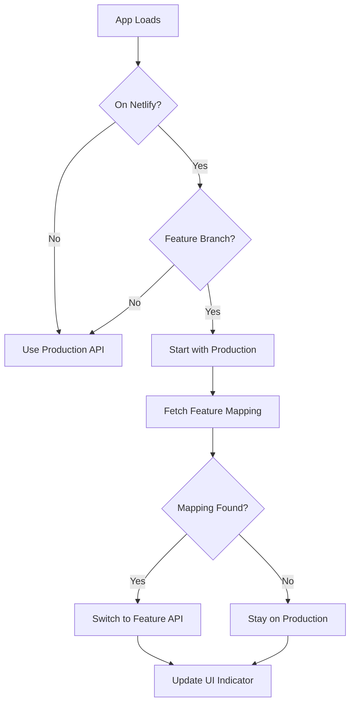

# Feature Deployment API Resolution

This document explains how the frontend dynamically resolves backend API URLs for feature branch deployments on Netlify.

## Overview

When developing features, we often need isolated backend environments that match feature branches. This system automatically detects when the frontend is running on a Netlify feature deployment and switches the API endpoint to the corresponding feature backend.

## How It Works

### 1. Detection Logic

The system only activates on Netlify deployments by checking the hostname:
- **Activates on**: `feature-auth--huposalesai.netlify.app`
- **Skips on**: 
  - `staging--huposalesai.netlify.app` (handled separately)
  - `localhost` or `127.0.0.1` (local development)
  - Production domains

### 2. Branch Name Extraction

Feature branch names are extracted from Netlify's URL pattern:
```
feature-auth--huposalesai.netlify.app → "feature/auth"
```

Hyphens in the subdomain are converted to slashes to match Git branch naming conventions.

### 3. Dynamic Backend Resolution

```typescript
// Production: Always uses env variable
getBackendUrl() → process.env.VITE_API_BASE_URL

// Netlify feature deployment:
1. Starts with production API
2. Fetches mapping from production: /api/feature-mapping.json
3. If feature backend exists, switches to feature URL
4. Falls back to production if no mapping found
```

### 4. Mapping File Structure

The backend provides a simple branch → URL mapping:
```json
{
  "feature/auth": "https://feature03.trainapi.hupo.co",
  "feature/payments": "https://feature04.trainapi.hupo.co"
}
```

## Implementation Details

### Files Structure

```
app/
├── util/
│   ├── api.ts                 # Main API client (3 lines changed)
│   └── netlify-backend.ts     # All complexity isolated here
├── components/
│   └── BackendIndicator.tsx   # Visual indicator component
└── layouts/
    └── sidebar.tsx            # Shows indicator in sidebar
```

### Key Functions

#### `api.ts` - Minimal Changes
```typescript
// Only 3 changes made:
import { getBackendUrl } from './netlify-backend';

export function api() {
  return wretch(getBackendUrl(), { mode: 'cors' })
    // ... rest unchanged
}

export function apiProtected() {
  return api().auth(`Bearer ${token}`)
    // ... rest unchanged
}
```

#### `netlify-backend.ts` - All Complexity
```typescript
// State management
const state = {
  baseUrl: env.VITE_API_BASE_URL,
  isLoading: false,
  featureName: null,
  isFeature: false
};

// Public API
export function getBackendUrl(): string
export function subscribeToBackendState(callback): () => void
```

### State Flow



## Visual Feedback

The `BackendIndicator` component provides real-time feedback:

### Location
- **Desktop**: Below logo in left sidebar
- **Mobile**: Below logo in mobile sidebar
- **Fixed Position**: Bottom-right corner (fallback)

### States
- 🚀 **Production** (blue) - Using production backend
- 🚧 **feature-name** (orange) - Using feature backend  
- ⏳ **Loading...** (pulsing) - Fetching mapping

### Display Rules
```typescript
// Only shows on Netlify deployments
if (!hostname.includes('.netlify.app')) return null;

// Skip staging branch (handled separately)
if (hostname === 'staging--huposalesai.netlify.app') return null;
```

## Benefits

### 1. **Clean Separation**
- `api.ts` stays simple (only 3 lines changed)
- All complexity isolated in `netlify-backend.ts`
- Easy to maintain and understand

### 2. **Robust Fallbacks**
- Starts with production API (always works)
- Graceful degradation if mapping fails
- No breaking changes to existing code

### 3. **Developer Experience**
- Automatic detection and switching
- Clear visual feedback
- No manual configuration needed

### 4. **Production Safety**
- Only activates on `.netlify.app` domains
- Skips local development
- Skips staging environment

## Configuration

### Environment Variables
```bash
# Frontend (.env)
VITE_API_BASE_URL=https://trainapi.hupo.co
```

### Backend Endpoint
The backend must provide the mapping at:
```
GET /api/feature-mapping.json
```

## Troubleshooting

### Common Issues

1. **Indicator not showing**
   - Check if on `.netlify.app` domain
   - Verify not on staging branch
   - Check browser console for errors

2. **Still using production API**
   - Check if branch name matches backend mapping
   - Verify feature backend is deployed
   - Check network tab for mapping fetch

3. **API calls failing**
   - Feature backend might be down
   - CORS issues with feature domain
   - Check backend logs

### Debug Tools

```typescript
import { getBackendState } from '~/util/netlify-backend';

// In browser console:
console.log(getBackendState());
// {
//   baseUrl: "https://feature03.trainapi.hupo.co",
//   isLoading: false,
//   featureName: "auth",
//   isFeature: true
// }
```

## Future Enhancements

- **Caching**: Cache mapping for better performance
- **Health Checks**: Verify feature backend health
- **Manual Override**: Dev tools to force specific backend
- **Retry Logic**: Retry failed mapping fetches
- **Analytics**: Track feature backend usage